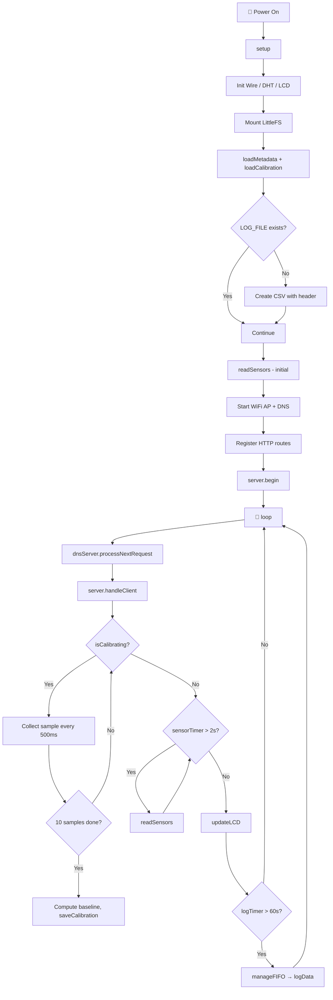
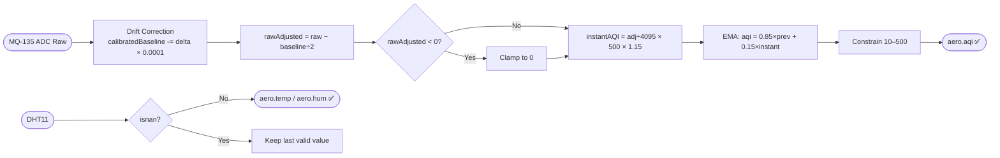
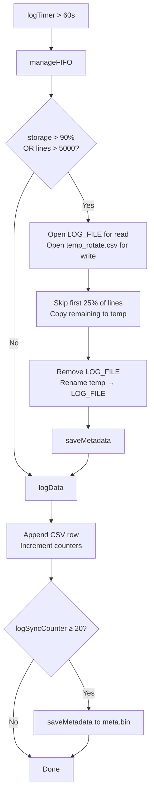
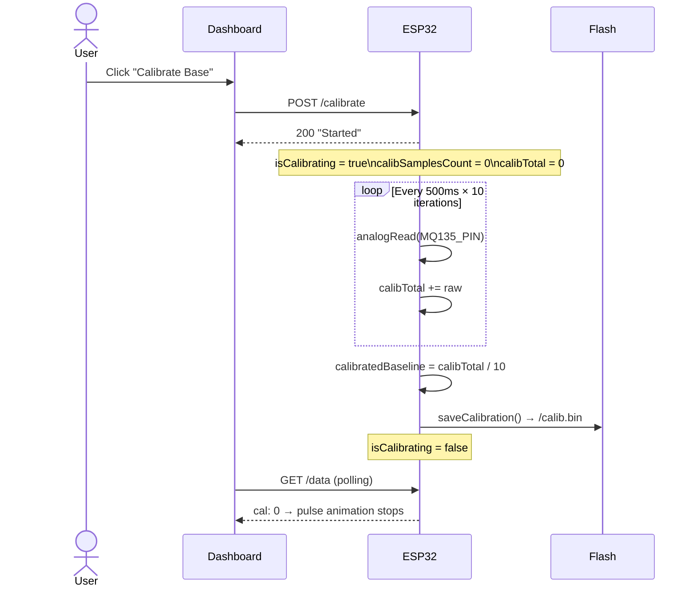
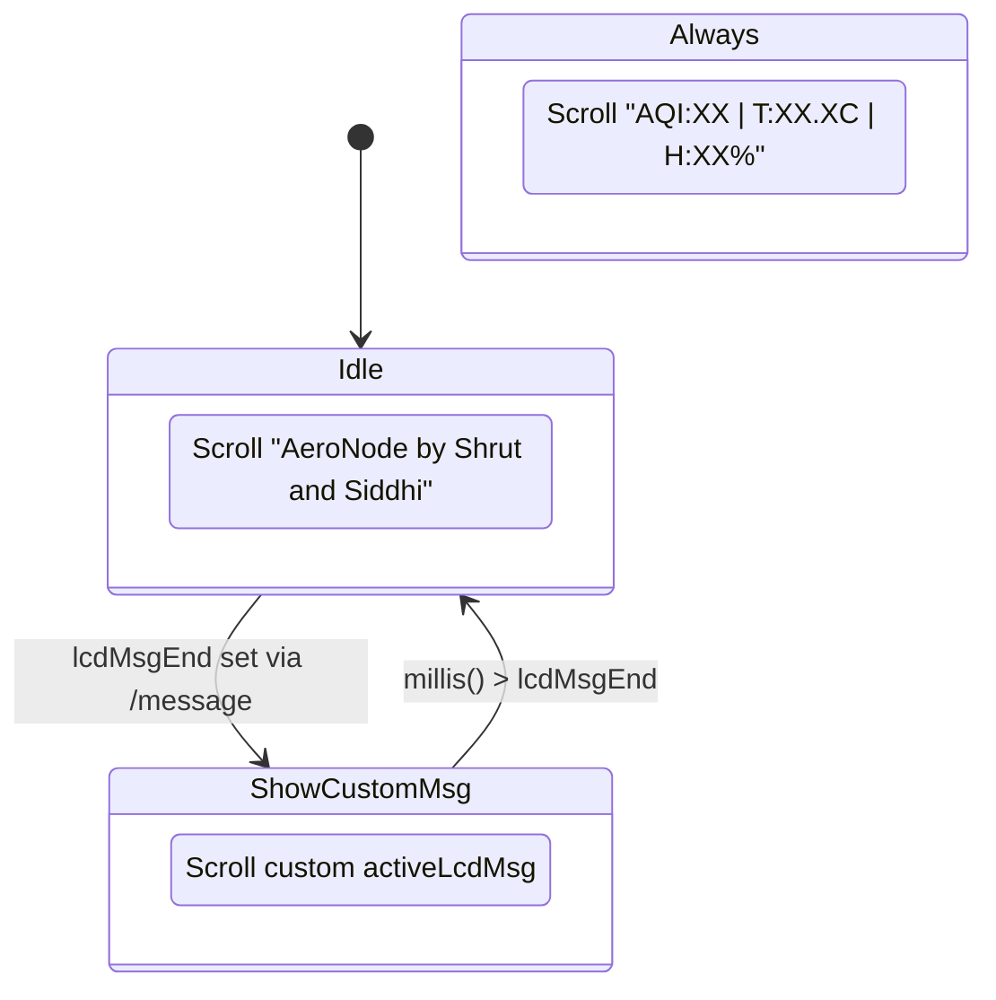
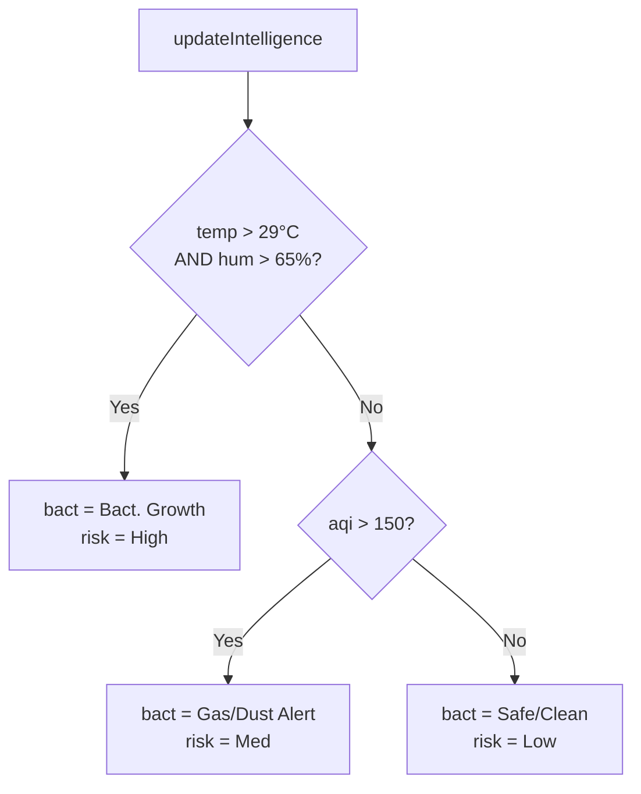

# 🌬️ AeroNode — Smart Air Quality Monitor

> **A self-contained, WiFi-enabled air quality station built on ESP32** — featuring real-time AQI estimation, temperature/humidity sensing, an OLED-style scrolling LCD, a dark-themed web dashboard, and persistent flash logging with FIFO rotation.

---

## 📋 Table of Contents

- [Overview](#-overview)
- [Hardware Requirements](#-hardware-requirements)
- [Pin Configuration](#-pin-configuration)
- [Feature Summary](#-feature-summary)
- [System Architecture](#-system-architecture)
- [Sensor Pipeline](#-sensor-pipeline)
- [Data Logging & Storage Management](#-data-logging--storage-management)
- [Calibration Flow](#-calibration-flow)
- [LCD Behavior](#-lcd-behavior)
- [Web Dashboard Endpoints](#-web-dashboard-endpoints)
- [Dashboard JSON Schema](#-dashboard-json-schema)
- [AQI Classification](#-aqi-classification)
- [Risk Intelligence Logic](#-risk-intelligence-logic)
- [WiFi & Captive Portal](#-wifi--captive-portal)
- [File System Layout](#-file-system-layout)
- [Configuration Reference](#-configuration-reference)
- [Loop Timing](#-loop-timing)
- [Getting Started](#-getting-started)
- [Known Limitations](#-known-limitations)

---

## 🧭 Overview

AeroNode is a standalone embedded air quality node that requires **no internet connection or external infrastructure**. It spins up its own WiFi Access Point and serves a live monitoring dashboard over HTTP. Sensor readings are logged to LittleFS flash with automatic FIFO rotation to prevent storage exhaustion.

```
Phone / Laptop  ──WiFi──►  ESP32 (AP: "AeroNode")  ──I2C──►  LCD
                                    │
                          ┌─────────┴─────────┐
                          │   DHT11   MQ-135   │
                          └───────────────────┘
                                    │
                              LittleFS Flash
                          (logs, calib, metadata)
```

---

## 🔧 Hardware Requirements

| Component | Model | Purpose |
|---|---|---|
| Microcontroller | ESP32 (any variant) | Main compute, WiFi AP, ADC |
| Temperature/Humidity | DHT11 or DHT22 | Ambient T/H sensing |
| Gas Sensor | MQ-135 | VOC / CO2 / AQI proxy |
| Display | 16×2 I2C LCD (0x27) | Live scrolling readout |
| Storage | Internal Flash (LittleFS) | CSV log persistence |

### 📦 Required Libraries

| Library | Purpose |
|---|---|
| `WiFi.h` / `WebServer.h` | AP mode + HTTP server |
| `DNSServer.h` | Captive portal DNS |
| `LittleFS.h` | Flash filesystem |
| `DHT.h` | DHT11/22 driver |
| `Wire.h` | I2C bus |
| `LiquidCrystal_I2C.h` | LCD driver |

---

## 🔌 Pin Configuration

| GPIO | Connected To | Type |
|---|---|---|
| `4` | DHT11 Data | Digital In |
| `34` | MQ-135 AOUT | Analog In (ADC1) |
| `21` | I2C SDA (LCD) | I2C |
| `22` | I2C SCL (LCD) | I2C |

> ⚠️ GPIO 34 is input-only on ESP32. Do **not** drive it as output. Use ADC1 pins (32–39) for MQ-135 to avoid WiFi-induced ADC2 noise.

---

## ✨ Feature Summary

| Category | Feature |
|---|---|
| 📡 Connectivity | Standalone WiFi Access Point — no router needed |
| 🌐 Dashboard | Dark-themed, mobile-responsive, Chart.js live graphs |
| 🌡️ Sensing | DHT11/22 temperature + humidity; MQ-135 AQI proxy |
| 💾 Logging | Persistent CSV on LittleFS, 60-second interval |
| 🔁 FIFO Rotation | Auto-trims oldest 25% of logs when >90% full or >5000 lines |
| 🔧 Calibration | Web-triggered 5-second baseline capture (10 samples @ 500ms) |
| 📟 LCD | Dual-row scrolling display; web-overridable top message |
| 📥 Export | `/download` endpoint streams CSV with `Content-Disposition` |
| 🧠 Intelligence | Bacteria growth and gas/dust risk classification |
| 🔁 Drift Correction | Slow baseline decay for long-term MQ-135 drift compensation |

---

## 🏗️ System Architecture



---

## 📡 Sensor Pipeline



| Parameter | Formula | Notes |
|---|---|---|
| Raw Adjusted | `raw − (baseline / 2)` | Subtracts half-baseline to centre noise floor |
| Instant AQI | `(rawAdj / 4095) × 500 × 1.15` | Linear map + 15% sensitivity boost |
| Smoothed AQI | `0.85 × prev + 0.15 × instant` | EMA, τ ≈ 12 seconds at 2s interval |
| CI (Contamination Index) | `0.5 + (aqi / 350)` | Normalised risk scalar |
| Drift Rate | `0.0001` per cycle | Conservative long-term self-correction |

---

## 💾 Data Logging & Storage Management



### 📊 Log CSV Format

| Column | Type | Example |
|---|---|---|
| `ID` | `unsigned long` | `1042` |
| `AQI` | `float (1dp)` | `47.3` |
| `Temp` | `float (1dp)` | `28.5` |
| `Hum` | `float (1dp)` | `62.0` |
| `CI` | `float (2dp)` | `0.64` |
| `Status` | `string` | `Safe/Clean` |
| `Risk` | `string` | `Low` |

### 🗂️ Persistence Files

| File | Format | Contents |
|---|---|---|
| `/aeronode_logs.csv` | CSV text | Sensor log rows |
| `/meta.bin` | Binary (8 bytes) | `logCounter` + `currentLines` (2× `unsigned long`) |
| `/calib.bin` | Binary (4 bytes) | `calibratedBaseline` (`float`) |

---

## 🔧 Calibration Flow



> 💡 **Best practice:** Place the sensor in clean outdoor air or near an open window before triggering calibration. The baseline persists across reboots via `/calib.bin`.

---

## 📟 LCD Behavior



| Row | Default Content | Override |
|---|---|---|
| Top (row 0) | `AeroNode by Shrut and Siddhi` | Any string via `POST /message` |
| Bottom (row 1) | `AQI:47 \| T:28.5C \| H:62%` | Not overridable |
| Scroll Speed | 350ms per character step | Hardcoded |
| Max message length | 64 characters | `activeLcdMsg[65]` |

---

## 🌐 Web Dashboard Endpoints

| Method | Route | Description | Auth |
|---|---|---|---|
| `GET` | `/` | Full dashboard HTML (served from PROGMEM) | None |
| `GET` | `/data` | Live JSON sensor payload | None |
| `POST` | `/message?msg=&dur=` | Override LCD top row | None |
| `POST` | `/calibrate` | Trigger baseline calibration | None |
| `GET` | `/history` | Stream raw CSV (inline) | None |
| `GET` | `/download` | Download CSV as `history.csv` | None |
| `GET` | `/*` (catch-all) | Captive portal redirect to `192.168.4.1` | None |

> 🔒 All endpoints are unauthenticated — AeroNode is designed for trusted local/home environments. Add HTTP Basic Auth if deploying in shared spaces.

---

## 📦 Dashboard JSON Schema

`GET /data` returns:

```json
{
  "aqi":    47.3,
  "aqiS":   "Good",
  "temp":   28.5,
  "hum":    61.0,
  "ci":     0.64,
  "bact":   "Safe/Clean",
  "risk":   "Low",
  "storage": 12.4,
  "records": 1042,
  "cal":    0
}
```

| Field | Type | Description |
|---|---|---|
| `aqi` | `float` | Smoothed estimated AQI (10–500) |
| `aqiS` | `string` | Human-readable AQI band |
| `temp` | `float` | Temperature in °C |
| `hum` | `float` | Relative Humidity % |
| `ci` | `float` | Contamination Index scalar |
| `bact` | `string` | Air condition label |
| `risk` | `string` | Risk tier: Low / Med / High |
| `storage` | `float` | Flash used % |
| `records` | `ulong` | Total log entries written |
| `cal` | `int` | `1` = calibration in progress |

---

## 🟢 AQI Classification

| AQI Range | Label | Dashboard Color |
|---|---|---|
| 10 – 49 | 🟢 Good | `#10a37f` (green) |
| 50 – 99 | 🟡 Moderate | `#10a37f` |
| 100 – 500 | 🔴 Poor | `#10a37f` |

> ⚠️ AQI values here are **estimated** from a raw MQ-135 ADC reading, not calibrated against a certified reference. Treat as relative/indicative readings only.

---

## 🦠 Risk Intelligence Logic



| Condition | `bact` Label | `risk` |
|---|---|---|
| `temp > 29°C` AND `hum > 65%` | `Bact. Growth` | `High` |
| `aqi > 150` | `Gas/Dust Alert` | `Med` |
| Otherwise | `Safe/Clean` | `Low` |

---

## 📶 WiFi & Captive Portal

| Parameter | Value |
|---|---|
| Mode | `WIFI_AP` (Access Point) |
| SSID | `AeroNode` |
| Password | `12345678` |
| IP Address | `192.168.4.1` |
| Subnet | `255.255.255.0` |
| DNS Port | `53` (wildcard `*` → `192.168.4.1`) |
| Captive routes | `/generate_204`, `/fwlink`, `onNotFound` |

Connect to the `AeroNode` WiFi network, then navigate to **`http://192.168.4.1`**. Most mobile devices will automatically prompt the captive portal.

---

## 🗃️ File System Layout

```
LittleFS (Flash)
├── aeronode_logs.csv     ← Rotating sensor log
├── meta.bin              ← logCounter + currentLines
└── calib.bin             ← MQ-135 calibrated baseline
```

---

## ⚙️ Configuration Reference

| `#define` | Default | Description |
|---|---|---|
| `SSID_AP` | `"AeroNode"` | WiFi AP SSID |
| `PASS_AP` | `"12345678"` | WiFi AP password |
| `LOG_FILE` | `"/aeronode_logs.csv"` | Primary log path |
| `META_FILE` | `"/meta.bin"` | Metadata persistence path |
| `CALIB_FILE` | `"/calib.bin"` | Calibration persistence path |
| `DHTPIN` | `4` | GPIO for DHT data line |
| `DHTTYPE` | `DHT11` | Sensor model (`DHT11` or `DHT22`) |
| `MQ135_PIN` | `34` | ADC GPIO for MQ-135 AOUT |
| `LCD_ADDR` | `0x27` | I2C address of LCD backpack |
| `MAX_LOG_LINES` | `5000` | FIFO trigger threshold (line count) |
| `DRIFT_SMOOTHING` | `0.0001f` | MQ-135 baseline drift decay rate |

---

## ⏱️ Loop Timing

| Task | Interval | Mechanism |
|---|---|---|
| Sensor read (DHT + MQ-135) | 2000 ms | `sensorTimer` |
| LCD top row scroll step | 350 ms | `topScrollTimer` |
| LCD bottom row scroll step | 350 ms | `bottomScrollTimer` |
| Log to flash | 60,000 ms | `logTimer` |
| Metadata flush | Every 20 logs | `logSyncCounter` |
| Calibration sample | 500 ms × 10 | `calibLastSample` |

---

## 🚀 Getting Started

**1. Hardware setup**

Wire DHT11 to GPIO 4, MQ-135 AOUT to GPIO 34, and the I2C LCD to SDA/SCL (GPIO 21/22). Power MQ-135 with 5V and allow ~2 minutes warm-up before calibrating.

**2. Install libraries**

In Arduino IDE: install `DHT sensor library` (Adafruit), `LiquidCrystal I2C` (Frank de Brabander), and ensure `LittleFS` is available via the ESP32 board package (≥ 2.0).

**3. Flash**

Select your ESP32 board, set Partition Scheme to `"Default 4MB with spiffs"` or any scheme that includes a LittleFS/SPIFFS partition ≥ 1MB, then Upload.

**4. Connect**

Join WiFi `AeroNode` (password `12345678`), open `http://192.168.4.1` in a browser.

**5. Calibrate**

Place the device in clean air for 2 minutes, then click **Calibrate Base** on the dashboard. Calibration runs for ~5 seconds and persists across reboots.

---

## ⚠️ Known Limitations

| Limitation | Detail |
|---|---|
| AQI is estimated | MQ-135 is a multi-gas sensor with no factory CO2 calibration; values are relative indicators |
| No RTC / timestamps | Logs use an incrementing counter, not wall-clock time |
| Single client optimised | WebServer handles one request at a time; concurrent dashboard tabs may queue |
| DHT11 resolution | ±2°C / ±5% RH accuracy; upgrade to DHT22 for tighter tolerance |
| No HTTPS | Dashboard is plain HTTP — fine for local AP use, not suitable for public networks |
| Flash wear | Logging every 60s = ~1440 writes/day; LittleFS mitigates but flash has finite P/E cycles |

---
## 👥 Collaborators

<p align="center">
  <a href="https://github.com/shrutmpatil"></a>
  <a href="https://github.com/siddhilad920"></a>
</p>
<p align="center">
  <a href="https://www.linkedin.com/in/shrutmpatil/">
    
  <a href="https://www.linkedin.com/in/lad-siddhi/">
    
  </a>
</p>

<div align="center">

**AeroNode** — *Breathe with data* 🌿

Made with ❤️ by Shrut and Siddhi

</div>
